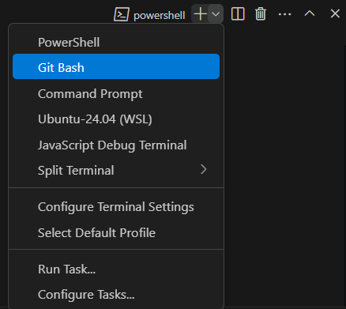

# 💻 Design and Develop Multi-Agent Systems

Welcome! 🚀

In this session, you will learn the basic concepts of AI agents and how to build your first AI agent using [LangGraph](https://www.langchain.com/langgraph).
This repository contains the source code for the hands-on that we will be working on during the "Design and Develop Multi-Agent Systems" course. The exercises are defined in Jupyter notebooks with the necessary instructions and code snippets to guide you through the process of building your first AI agent.

## Pre-requisites

Before we start, make sure you have the following prerequisites installed on your machine:

- [Visual Studio Code](https://code.visualstudio.com/)
- [Python](https://www.python.org/downloads/)
- [Git](https://git-scm.com/downloads)

**N.B.**: During the hands-on session, all necessary tools, environments and libraries will already be pre-installed on the lab computers. You do not need to follow the setup instructions below unless you are working on your own machine outside of the hands-on lab.

It is necessary to have a OpenAI API key stored in a file named `.env` in the root directory of the project.

### Setup the environment:

#### 0. Clone the repository

Clone the repository containing the exercises to your local system. If you’re unfamiliar with cloning a GitHub repository, you can follow [this](https://docs.github.com/en/repositories/creating-and-managing-repositories/cloning-a-repository) guide.

#### 1. Create a new [python virtual environment](https://docs.python.org/3/tutorial/venv.html) in the project directory

For Linux/Mac users:

```bash
python -m venv .venv
source .venv/bin/activate
```

For Windows users (using PowerShell)

```bash
python -m venv .venv
Set-ExecutionPolicy -ExecutionPolicy Bypass -Scope Process
.\.venv\Scripts\activate
```

For Windows users (using Git Bash)

```bash
python -m venv .venv
source .venv/Scripts/activate
```

To run commands in Git Bash inside Visual Studio Code:

1. Click on the top menu: **Terminal → New Terminal**  
2. Click the dropdown arrow near the terminal tab (usually says `powershell`)  
3. Select **Git Bash** from the list of available terminals  

You should now see a Git Bash session in the terminal window.  
👉 *Reference image:*  


Once you've activated the environment, your terminal prompt will show something like this:

```bash
(.venv)
```

This means your virtual environment is active and ready to use!  

#### 2. After activating the virtual environment, install the required dependencies

```bash
pip install -r requirements.txt
```

**N.B.**: Make sure that the virtual environment is activated in your current terminal session before running the above command.

#### 3. Install the [Python](https://marketplace.visualstudio.com/items?itemName=ms-python.python) and [Jupyter](https://marketplace.visualstudio.com/items?itemName=ms-toolsai.jupyter) extensions for VSCode

#### 4. Open the project folder in VSCode and open the notebook `0 - Environment Test.ipynb`

#### 5. Check (in the top right corner) if the kernel is set to the virtual environment you created in the previous step. If not, change the kernel to the virtual environment

#### 6. Run the first cell of the notebook `0 - Environment Test.ipynb` to test the setup

If you need help or have any questions, feel free to reach out to us. We are here to help you! 🤗

Good luck and have fun! 🎉

## 🔗 Some useful links

- [Jupyter Notebooks in VS Code](https://code.visualstudio.com/docs/datascience/jupyter-notebooks#_create-or-open-a-jupyter-notebook)
- [More on LLM agents](https://www.promptingguide.ai/it/research/llm-agents)
- [More on agents reasoning](https://www.promptingguide.ai/it/techniques/react)
- [More on LangGraph](https://www.langchain.com/langgraph)
- [ReAct Paper](https://arxiv.org/abs/2210.03629)
